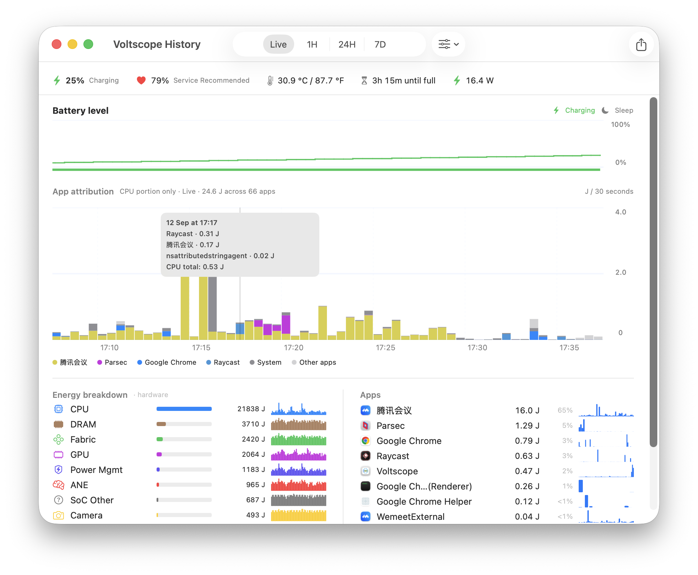
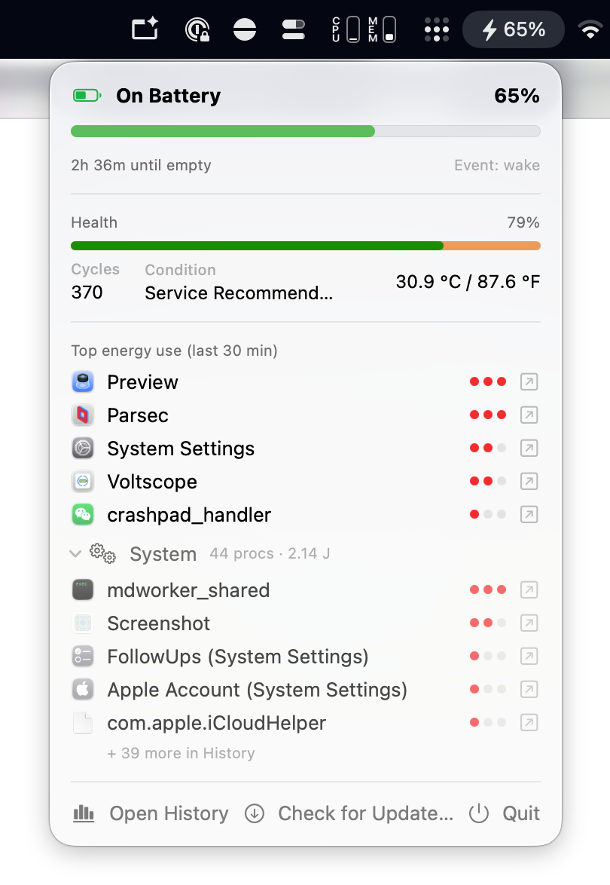

# Voltscope

> A native macOS battery and energy-history monitor inspired by iPhone Settings → Battery.

[](https://github.com/dimpurr/voltscope/actions/workflows/ci.yml)
[](https://github.com/dimpurr/voltscope/releases/latest)
[](https://github.com/dimpurr/voltscope/releases)
[](LICENSE)
[](https://www.apple.com/macos/)

Voltscope runs quietly in the menu bar and records which processes keep using
energy over time. Open History when you want a longer view: battery level,
stacked App CPU attribution, hardware energy buckets, and the Apps breakdown
share one time range.

Voltscope is open source under the MIT license. It is also local-only: the app
keeps monitoring data on your Mac and sends no telemetry, analytics, or remote
crash reports.

<div align="center">
  
  
</div>

## Install

Voltscope is distributed as one signed and notarized universal2 app. The
website DMG and the GitHub Release download are equivalent mirrors of the same
artifact; choose whichever is more convenient.

### 1. Download the app

- **[Official website DMG](https://voltscope.dimp.studio/Voltscope.dmg)**
- **[Latest GitHub Release](https://github.com/dimpurr/voltscope/releases/latest)**

Both links provide the latest universal2 DMG for macOS 13 or later, with
native `arm64` and `x86_64` slices.

### 2. Install with Homebrew

Use the maintained community tap:

```bash
brew install --cask dimpurr/tap/voltscope
```

The equivalent two-step form is `brew tap dimpurr/tap` followed by
`brew install --cask voltscope`. Update with `brew update && brew upgrade
--cask voltscope`, or remove it with `brew uninstall --cask voltscope`.

### 3. Build from source

For development or a reproducible local build, follow [Build from
source](#build-from-source) below.

## Getting started

1. Open the downloaded DMG (or install with Homebrew) and move
   `Voltscope.app` to `Applications` if you used the DMG.
2. Open Voltscope. On the first normal launch, choose whether to enable
   **Launch at login** in the Welcome window. It then appears in the menu bar.
3. Choose **Open History** from the menu bar panel when you want to inspect
   observations. Leave Voltscope running, or enable Launch at login in
   **Settings…**, to keep sampling continuous.
4. Use **Live**, **1H**, **6H**, **24H**, or **7D** in the History toolbar. The
   battery chart, App CPU chart, bottom columns, hover details, and CSV export
   all follow that single range.

Core monitoring requires no account, helper service, or special permission.
Launch at login is optional and macOS may ask for approval in Login Items. The
local database is stored at:

```text
~/Library/Application Support/Voltscope/db.sqlite
```

## What Voltscope measures

- **App attribution** is the CPU portion attributed to each process by
  `proc_pid_rusage`. It is not a claim that the entire battery drain can be
  divided among apps.
- **Battery level** is a separate 0–100% state-of-charge history with charging,
  sleep, and missing-observation context.
- **Hardware buckets** are independent system measurements. They may overlap
  and are not expected to sum to App CPU attribution.
- Data stays on the Mac. Voltscope has no telemetry, analytics, or remote crash
  reporting.

## Build from source

Requirements:

- macOS 13 or later
- Xcode 16.3+ or a compatible Swift 6.1+ toolchain

Clone the repository and run the tests:

```bash
git clone https://github.com/dimpurr/voltscope.git
cd voltscope
swift test -Xswiftc -swift-version -Xswiftc 5
```

The compatibility flag keeps Swift 6.1 builds working with GRDB's current
Dispatch annotations; newer Swift toolchains may also accept plain `swift test`.

Build and open a local app bundle:

```bash
./scripts/build-app.sh release
open build/Voltscope.app
```

Create a Developer ID signed DMG when a signing identity is available:

```bash
./scripts/build-dmg.sh --signed --universal
```

For a public release, use `--release` instead. It submits the DMG to Apple
notarization, staples the ticket, and validates the result:

```bash
./scripts/build-dmg.sh --release --universal
```

The `--universal` build contains both Apple silicon (`arm64`) and Intel
(`x86_64`) slices. It is the artifact used by the website, GitHub Release,
and Homebrew tap.

The complete website/GitHub release, checksum, signing, and installation
procedure is documented in [RELEASE.md](RELEASE.md).

## Documentation

| Document | Purpose |
| --- | --- |
| [docs/INDEX.md](docs/INDEX.md) | Documentation ownership and source-of-truth rules |
| [docs/VISION.md](docs/VISION.md) | Product intent, principles, and scope |
| [docs/HLD.md](docs/HLD.md) | Architecture, persistence, sampling, and permissions |
| [docs/ENERGY_MODEL.md](docs/ENERGY_MODEL.md) | Energy units, denominators, intervals, and limits |
| [docs/UI_SPEC.md](docs/UI_SPEC.md) | Current interaction and layout contract |
| [CHANGELOG.md](CHANGELOG.md) | User-visible release history |
| [RELEASE.md](RELEASE.md) | Website and GitHub release procedure |
| [CONTRIBUTING.md](CONTRIBUTING.md) | Contribution expectations |

## Contributing

Issues, focused pull requests, documentation improvements, and macOS
compatibility reports are welcome. Read [AGENTS.md](AGENTS.md) before changing
code; it explains which document owns each decision and the checks expected for
a change.

Keep changes focused, run `git diff --check` and the test command above, and
update the owning specification and [CHANGELOG.md](CHANGELOG.md) when behavior
changes.

## License

Voltscope is released under the [MIT License](LICENSE).
